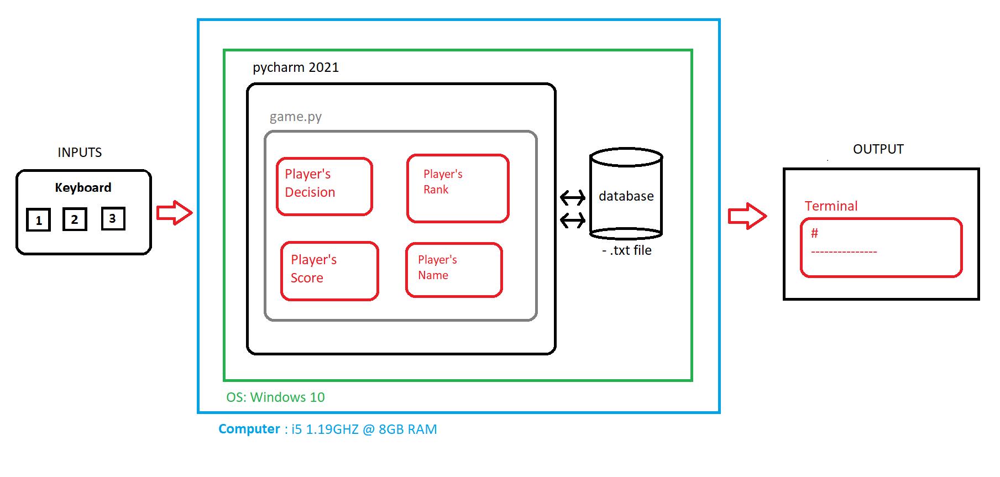

# Unit 1: A classic game 

# Criteria A: Planning

## Problem definition

The owner of the local game shop is an enthusiast of classic computer games. He has been looking for a talented programmer that can help him revive his passion for text-based games. He has few requirements for this task:

1. The game has to be entirely text-based.
2. The game must record the time played.
3. The game must record the player name and score.

Apart for this requirements, the owner is open to any type of game, topic or genre.

## Proposed Solution

Design Statement:

I will design and make a text-based survival game for a client who is a local game shop owner who is looking to revive his passion for old-school text-based games. The game will be about a the player getting communication with a man stranded on a mysterious island via a radio and needs help finding his way back home and is constructed using the software pycharm. It will take three weeks to make and will be evaluated according to the criteria that it is entirely text-based, the total game time is recorded, the player's name and score is recorded, any images or boxes surrounding the text be displayed cleanly, the score progression is accurate and constant and lastly that the game displays the player's name, time, score and rank in an accurate and clean manner. 

## Success Criteria

1. The game has to be entirely text-based.
2. The game must record the time played.
3. The game must record the player name and score.
4. Any images or boxes surrounding text must be displayed cleanly. 
5. The game's score progression must be accurate and constant to ensure fair gameplay.
6. The game must display the player's name, time, score and rank accurately at the end. 

# Criteria B: Design

## System Diagram

Figure 1. System Diagram for proposed solution.

## Flow Diagrams

## Record of Tasks
| Task No | Planned Action                                  | Planned Outcome                                                                    | Time estimate    | Target completion date | Criterion |
|---------|-------------------------------------------------|------------------------------------------------------------------------------------|------------------|------------------------|-----------|
| 1       | Coming up with an idea for a text-based game    | Have an idea that's simple yet fun to execute                                      | 2 days (weekend) | Monday 20th            | A         |
| 2       | Drawing rough flowchart of the overall story    | Have an overall idea of how the story's going to finish and how the code will look | 2 days           | Monday 27th            | A         |
| 3       | Coding the start introduction and instruction   | Make an entertaining yet understandable instruction manual                         | 1 day            | Saturday 26th          | B         |
| 4       | Create an encryption function for the user data | A function tested that uses the casesar cypher                                     |                  | October 6th            | C         |
