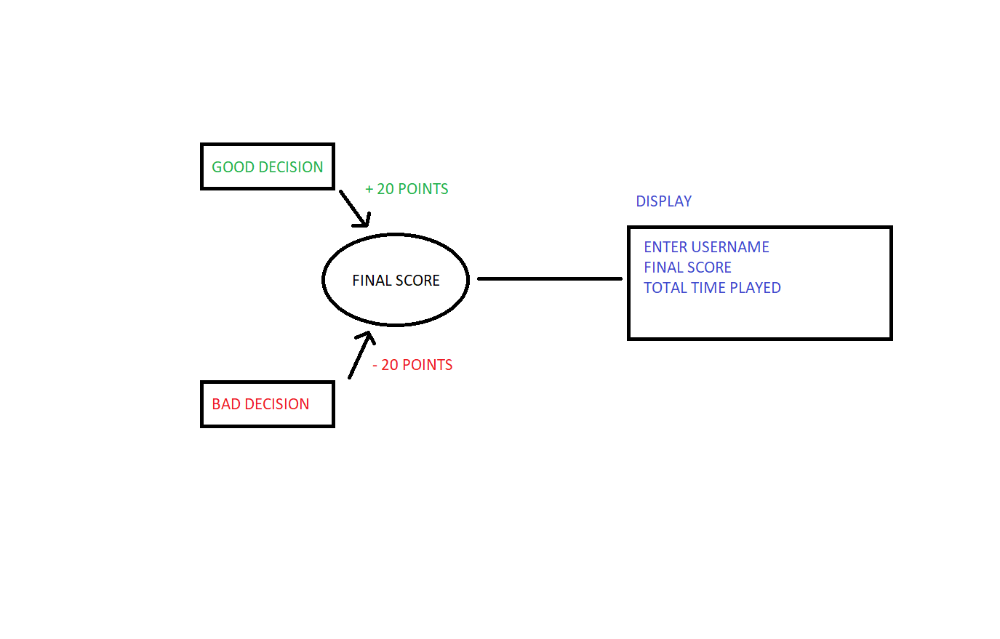
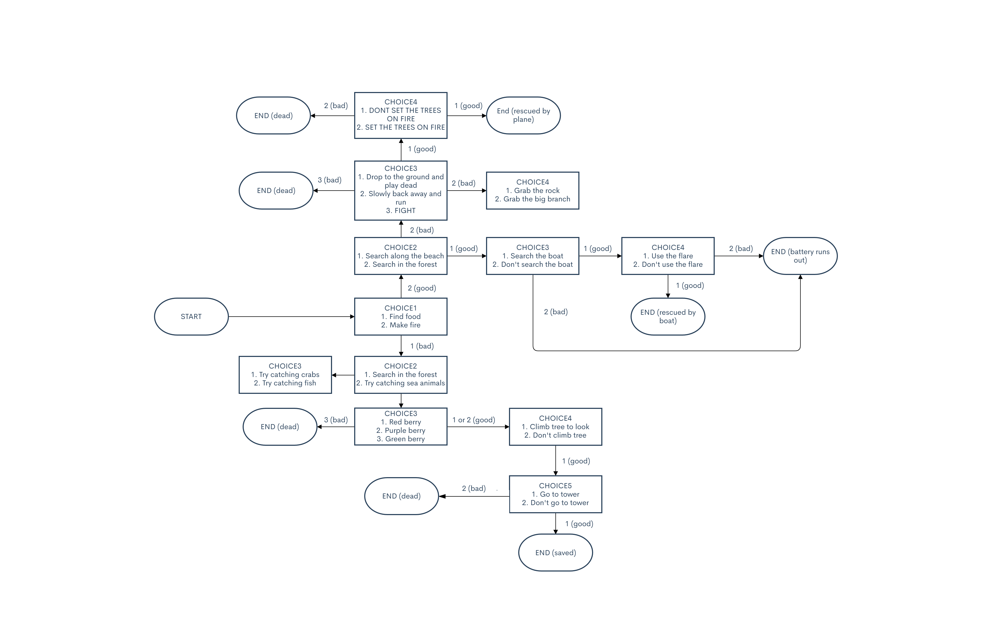
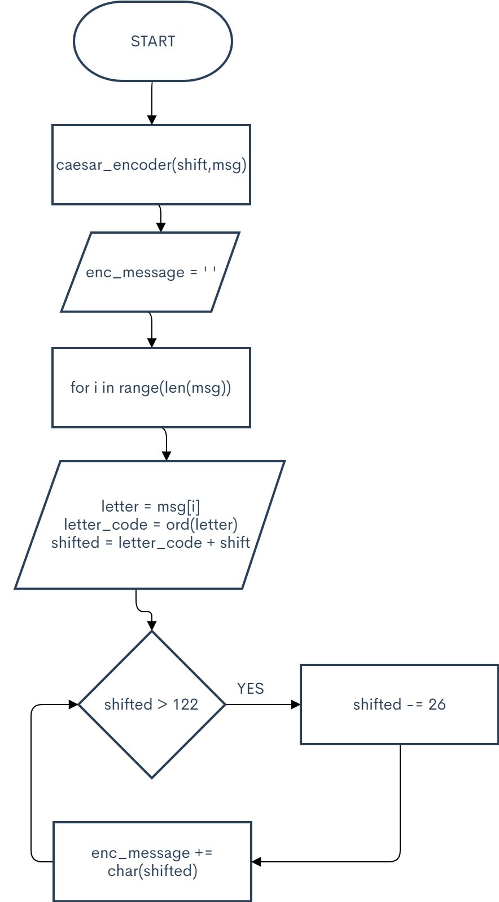
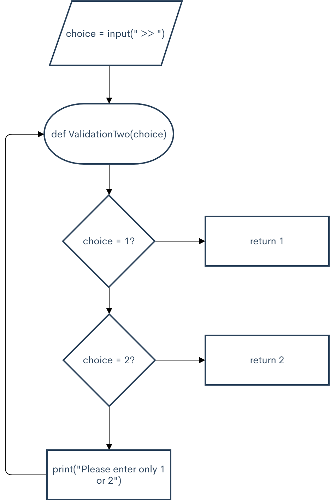
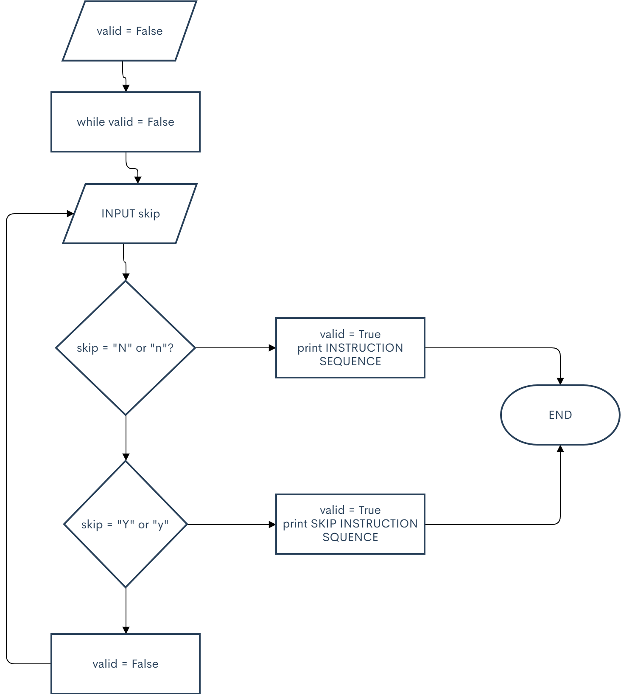
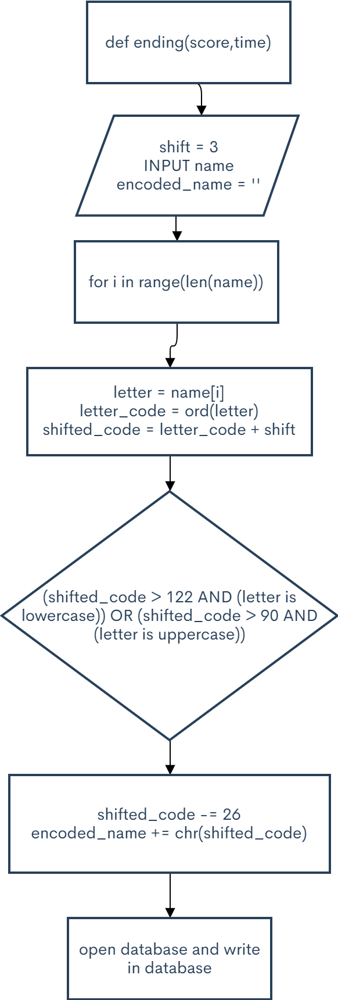

# Unit 1: A classic game 

# Criteria A: Planning

## Problem definition

The owner of the local game shop is an enthusiast of classic computer games. He has been looking for a talented programmer that can help him revive his passion for text-based games. He has few requirements for this task:

1. The game has to be entirely text-based.
2. The game must record the time played.
3. The game must record the player name and score.

Apart for this requirements, the owner is open to any type of game, topic or genre.

## Proposed Solution

Design Statement:

I will design and make a text-based survival game for a client who is a local game shop owner who is looking to revive his passion for old-school text-based games. The game will be about a the player getting communication with a man stranded on a mysterious island via a radio and needs help finding his way back home and is constructed using the software pycharm. It will take three weeks to make and will be evaluated according to the criteria that it is entirely text-based, the total game time is recorded, the player's name and score is recorded, any images or boxes surrounding the text be displayed cleanly, the score progression is accurate and constant and lastly that the game displays the player's name, time, score and rank in an accurate and clean manner. 

Personal Relevance:

The reason I have chosen to make a text-based game of a survival/dramatic game is because of inspiration from real text-based games like LIFELINE where the player has to communicate with a character that's stranded on another planet and needs help getting back home. My game is similar in the sense that the player is also helping the character get back from but from a mysterious island that they ended up in when they had a boating accident. I wanted to do a horror concept but upon planning and brainstorming I settled for no horror aspect in the game as I did not know how to make a successfully scary game. This survival game seems much more exciting which is what the end product is. 

## Success Criteria

1. The game has to be entirely text-based.
2. The game must record the time played.
3. The game must record the player name and score.
4. Any images or boxes surrounding text must be displayed cleanly. 
5. The game's score progression must be accurate and constant to ensure fair gameplay.
6. The game must display the player's name, time, score and rank accurately at the end. 

# Criteria B: Design

## System Diagram

**Figure 1** shows the System Diagram for proposed solution.

**Figure 2** shows the score progression system that the game will have (updated).

## Flow Diagrams

### Game map

**Figure 3** shows the map of the plot of the game.

### Caesar Cypher

The database in the game has to be protected so that the personal data is not exposed. To solve this requirement I am using the Caesar cypher.

**Figure 4** shows the flow diagram for this function.

### Validation for two options

**Figure 5** shows the flow diagram for this function.

### Skippable Instructions with validation

**Figure 6** shows the flow diagram for a skippable tutorial that only takes valid inputs.

### Ending 

  
  
  **Figure 7** shows the flow diagram for taking the username of the player and encoding the data before adding it to a text database.

## Record of Tasks
| Task No | Planned Action                                                | Planned Outcome                                                                    | Time estimate    | Target completion date | Criterion |
|---------|---------------------------------------------------------------|------------------------------------------------------------------------------------|------------------|------------------------|-----------|
| 1       | Coming up with an idea for a text-based game                  | Have an idea that's simple yet fun to execute                                      | 2 days (weekend) | Monday 20th            | A         |
| 2       | Drawing rough flowchart of the overall story                  | Have an overall idea of how the story's going to finish and how the code will look | 2 days           | Monday 27th            | A         |
| 3       | Coding the start introduction and instruction                 | Make an entertaining yet understandable instruction manual                         | 1 day            | Saturday 26th          | B         |
| 4       | Create an encryption function for the user data               | A function tested that uses the casesar cypher                                     |                  | October 6th            | C         |
| 5       | Integrate the encryption with the database save/load function | The database is encrypted and can be read/write                                    |                  | After game coded       | C         |
| 6       | Test the encoder when saving the data                         | Information on the database is encoded                                             |                  | After game coded       | C         |
| 7       | Drawing the score progression model                           | Have a score progression plan for the game                                         | 1 day            | October 7th            | A         |
| 8       | Drawing flowchart function for validation                     | Have a flowchart for validation in repos                                           | 1 day            | October 8th            | A         |
| 9       | Coding and testing validation for two and three choices       | Have a functioning validation system                                               |                  | October 9th            | B         |
| 10      | Make a new score progression model                            | Have a simpler score progression model                                             |                  | October 10th           | B         |
| 11      | Drawing flowchart for tutorial                                | Have a flowchart for tutorial in repos                                             |                  | October 11th           | A         |
| 12      | Test the tutorial                                             | Have a tutorial at the start that is skippable and clear                           |                  | October 12th           | B         |
| 13      | Coding the shortest ending of the game                        | Have the shortest ending functional and ready                                      |                  | October 16th           |           |
